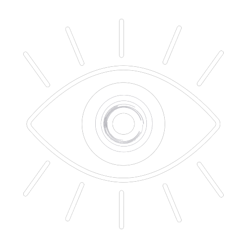
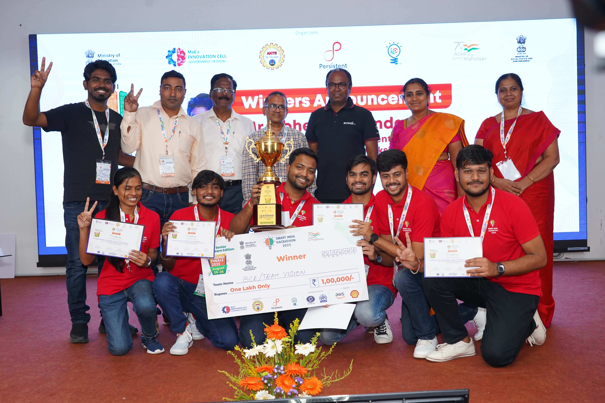

# 
 VoCo

<h2 align="center">Advanced Vocational Training Application 📱</h2>

<h2 align="center">TEAM VISION : Winner 🏆 Of Smart India Hackathon 2022 (SIH 2022) 🌟</h2>

<h2 align="center">COMPLETE DESCRIPTION</h2>

### PS ID : RK774

### Team ID : 23641

### PS Title :
Software for Vocational Training for persons with visual impairment

### PS Description :
<b>Background:</b> A web/app based solution required for vocational training for persons with visual impairment. It would have greater accessibility support and a better user interface.

<b>Situation:</b> Currently no such software is available for persons with visual impairment. Further because of their mobility, it is difficult for them to get offline vocational training. Such software will enable them to get suitable vocational training in the area of their interest and will enable them to become self dependent.

<b>Objective:</b> A web/app based platform such as PWAs, offline first applications which helps visually impaired persons accessibility to vocational training smoothly.

### Aim :
1. To Break Linguistic Barrier Between People With And Without Vision & Provide a Better Community Support.
2. To Reach a specific Audience to Improve their Vocational Skills  And Help Them to Get Better Jobs and Societal acceptance. 

### Summary :
The mobile app will have features such as to improve the vocal speech of the user, enhance subject knowledge, interactive live session with expert or bot and fun interactive games to train their mind. The app has very easy to use layout setup with voice powered in-app navigation support. 

### Objectives :
1. Train the user to improve their linguistic skills or learn new language.
2. The app will also provide study material and courses in audio format to be accessed easily.
3. Regular tests for our users to understand their improvement.
4. A proper feedback system for us to understand whether the user liked our course content or not.
5. Interactive chat bot feature in case the user wants someone to talk with when no one is around.
6. A feature to connect all the users together at real-time and they can have a conversation among themselves. This will improve their communication skills and can provide them recreational time with some new friends.
7. An option to even connect with a VoCo Expert to clear course related doubts and any queries they might have.
8. Fun and interactive games section to improve their mental ability and train their mind.
9. To improve the UI for more easy usability for the visually impaired people.

### Status :
We have implemented these features:
  1. User Login through Firebase
  2. Pronunciation Guide available with support in English language.
  3. In app navigation supported.
  4. In app voice based guide available.

### Tech Stacks Used :
⦿ <b>FrontEnd :</b> 
*  

⦿ <b>BackEnd :</b>
* 
 
 

⦿ <b>Server :</b>
* 

⦿ <b>Database :</b>
* 

### Important URLS :
⭐️ <b>VoCo.apk :</b> [Click Here to download our app](https://drive.google.com/file/d/1G2OAgv496ZIgfTvQDB9stnZZdOtdA90W/view?usp=sharing)

⭐️ <b>Main PPT :</b> [Click Here to View](https://www.canva.com/design/DAFKY0ISCIc/Dc9_AccjIlpIO0fpXs7zAg/edit)

⭐️ <b>Video : Understanding VoCo</b>

⭐️ <b>Video : VoCo App Guide</b>

⭐️ <b>Research Proposal :</b> [Click Here to View](https://drive.google.com/file/d/1IWLqan4KK0uA738anxIMGWorU3y1yo0H/view?usp=sharing)

⭐️ <b>Initial Basic Blue Print :</b> [Click Here to View](https://drive.google.com/file/d/1DbnphCEYUreNn5E48bvN6N0b3pgw_8ib/view?usp=sharing)

⭐️ <b>Extra : You can also watch our fun VLOG 😅</b>

---

## Project Created & Maintained By

## :heart: Team Vision
1. [Krishna Raj](https://github.com/krishna-raz)
2. [Ujjwal Raj](https://github.com/uzibytes)
3. [Rajnish Puri](https://github.com/RajnishPuri)
4. [Prashant Kumar](https://github.com/PkThunderBolt)
5. [Shubham Kumar](https://github.com/ItsWhiteDevil)
6. [Aradhana Kumari](https://github.com/aradhana2618)

### Hire Us

### How-to-run

- Clone this Repository.
- Install Flutter in your local.
- Open the cloned repository in VS Code
- Enter command - `flutter clean` at first.
- Then Enter Command - `flutter run` to start the application in your local emulator.
- Or you can directly use our application on your android phone by downloading the apk [link](https://drive.google.com/file/d/1G2OAgv496ZIgfTvQDB9stnZZdOtdA90W/view?usp=sharing).

## Support

💙 If you like this project, give it a ⭐ and share it with friends!
You are free to send us PRs and issues, We'd love to help and improve this.

<h1 align="center">🙏 THANK YOU 🙏</h1>

